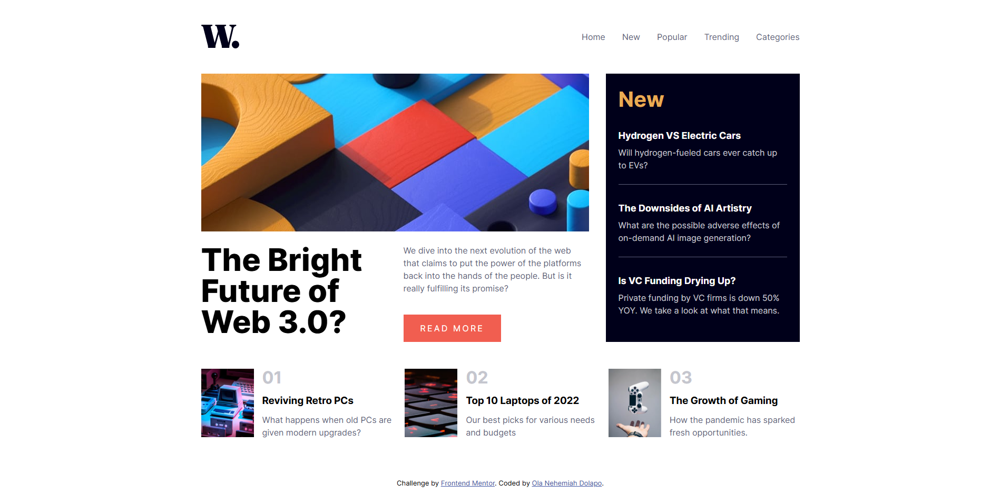

# Frontend Mentor - News homepage solution

This is a solution to the [News homepage challenge on Frontend Mentor](https://www.frontendmentor.io/challenges/news-homepage-H6SWTa1MFl). Frontend Mentor challenges help you improve your coding skills by building realistic projects.

## Table of contents

- [Overview](#overview)
  - [The challenge](#the-challenge)
  - [Screenshot](#screenshot)
- [My process](#my-process)
  - [Built with](#built-with)
  - [What I learned](#what-i-learned)
  - [Continued development](#continued-development)
  - [Useful resources](#useful-resources)
- [Author](#author)

## Overview

### The challenge

Users should be able to:

- View the optimal layout for the interface depending on their device's screen size
- See hover and focus states for all interactive elements on the page
- **Bonus**: Toggle the mobile menu (requires some JavaScript)

### Screenshot



## My process

### Built with

- Semantic HTML5 markup
- Flexbox
- CSS Grid
- Desktop-first workflow

### What I learned

#### CSS Grid

##### I can use auto, 1fr and minmax() to specify my grid sizes when using Grid-template-columns (and rows)

##### Grid-Template-Areas

It is used on the parent grid container to name each grid item and will later be used in the grid placememnt.
This totally replaces using grid-column or grid-rows.

```css
.grid-container {
  grid-template-areas: " header header" "main new" "extra_news extra_news";
}

.grid-item-1 {
  grid-area: "header"
}

.grid-item-2 {
  grid-area: "main"
}

.grid-item-3 {
  grid-area: "new"
}

.grid-item-4 {
  grid-area: "extra_news"
}
```

##### Grid Area
Whatever i named each grid item using "grid-template-area", i use this property to assign them to their specified grid space, like th example above.

#### using <nav> element conventionally
<nav> tag is used when building the navigation pane. The content of the navigation are then listed using <ul> <li> </ul> tags


#### I learnt what a FavIcon logo means.
Its simply that small logo that appears beside the website title in yur browser. Here is how to code it.

```html
<link rel="icon" href="logo.png" type="image/png">
```

### Continued development

- As at now it is static, i look to incorporate React to serve dynamic contents.


### Useful resources

- [Fav Icon](https://favicon.io/) - I used it to generate Fav Icons customed to all screen sizes, check [What I learned](#what-i-learned) if you dont know what that means.

## Author
- Frontend Mentor - [@nehhy01](https://www.frontendmentor.io/profile/nehhy01)
- GitHub - [@Nehhy01] (https://github.com/Nehhy01)
- LinkedIn [@Ola_Nehemiah] (https://www.linkedin.com/in/nehemiah-ola)
